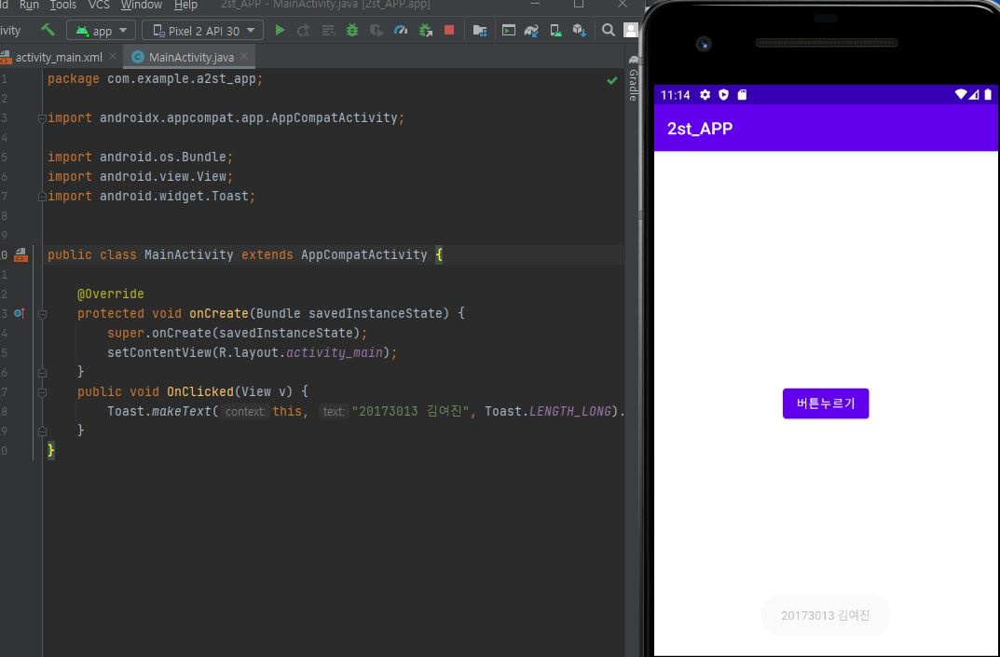
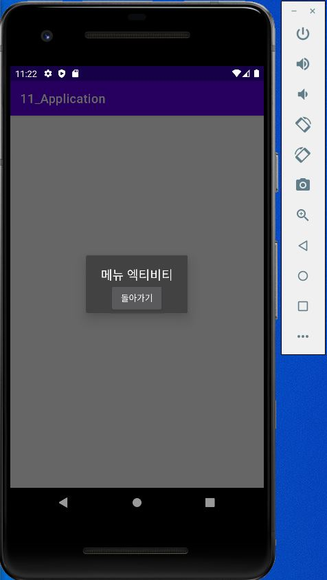

# 20173013 김여진

## 1주차

## 2주차
  - Github사용법
 

</img>

</img>

## 3주차
  -1. 네이버 화면(다른사이트 여도 상관없음)
</img>
  -2. 전화번호 입력창 화면( 본인 학번으로 입력)
</img>
## 4주차
내가 만들고 싶은 앱 기획 아이디어
:여행 계획을 쉽고 빠르게 짤 수 있게 해주는 앱
1) 여행 일정을 기준으로 가볼 만한 나라/지역을 추천해 줌
2) 여행지를 선택했다면, 숙소를 평점, 인기, 인테리어 취향 등 다양한 카테고리로 나눠서 추천해 줌
3) 숙소를 정했다면, 주변 관광지나 맛집, 소품 숍 등도 위와 같은 다양한 카테고리로 나눠서 추천해 줌
4) 추천해 준 가게나 관광지 중 내가 가고 싶은 곳을 다 선택하면, 그동안 수집한 데이터를 토대로 가장 효율적인 여행 계획을 제시해 주고 예상경비도 알려줌
## 5주차
</img>
</img>
## 6주차
</img>
</img>
## 9주차
</img>
## 10주차
</img>
</img>
</img>
## 11주차
</img>
## 12주차
</img>
## 13주차
</img>

